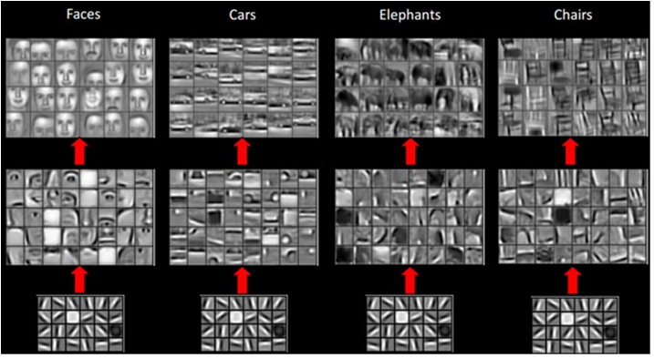

## Automated Feature Engineering

If a CEO wants to know the state of their business, they ask their highest ranking executives.  These executives, in turn, should know the state of the business through reports from their subordinates.  This structure is roughly analogous to a process observed in deep learning, where each layer of the business reports up different types of observations, KPIs, and reports to be interpreted by the next layer of the business.  In deep learning, this process can be thought of as automated feature engineering.  DNNs built to recognize objects in images may learn structures that behave like edge detectors in the first hidden layer.  Proceeding layers learn to compose more abstract features from lower level outputs.  This episode explore that analogy in the context of automated feature engineering.

Linh Da and Kyle discuss a particular image in this episode.  The image included below in the shownotes is drawn from the work of Lee, Grosse, Ranganath, and Ng in their paper [Convolutional Deep Belief Networks for Scalable Unsupervised Learning of Hierarchical Representations](http://www.cs.toronto.edu/~rgrosse/icml09-cdbn.pdf).

