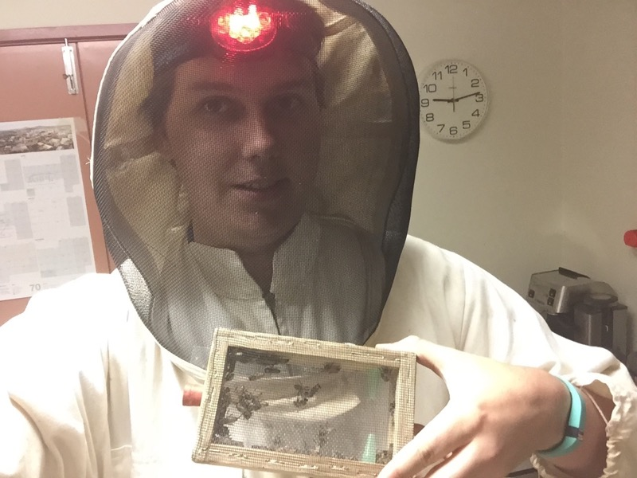
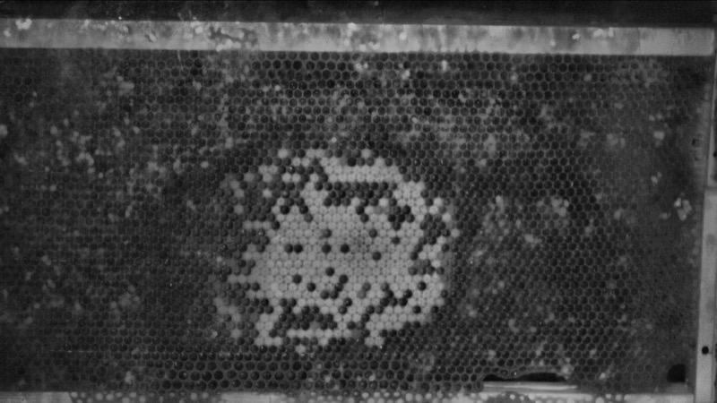
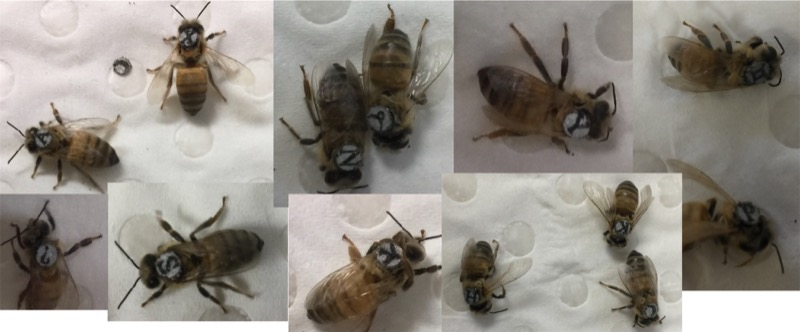

## Bees, lasers, and machine learning

A couple of years ago I started my PhD at the Australian National University working to quantify honeybee behaviour. We wanted to build a system that could automatically track and compare different groups of bees within the hive.

I took the project as I had a background in biology, beekeeping and programming, and I wanted to work in a lab where I could learn from a supervisor who was incredibly knowledgeable about both biology and software development.

The first challenge of the project was to develop a system for tagging the bees so that I could track and identify them. I'd also need to work out a camera setup that was able to utilise an infrared light which bees were unable to see (the natural state of a hive is that of darkness). This ruled out the option of using colour in the tags.

Initially, I was hopeful that this stage wouldn't take too long as I found some research by computer scientists who had created simple paper tags and glued them on the thorax of bees. While attempting to replicate this methodology, I discovered that the bees' hygienic response would result in them chewing the paper tags off their sisters within hours of them being introduced to the colony. Clearly this setup would not work if I wanted to quantify honeybee behaviour over a period of several weeks.

To save you a rather long and frustrating story, eventually I developed a system for tagging the bees with a reflective fabric that I had used a laser engraver to burn patterns into and cut out. Each tag was ~3mm in diameter and there were three classes: blank (for the queen), circle and rectangle.  My initial plan to identify the different classes was to simply segment out the patterns on the tags, and measure the size of the largest contour.

This simple logic appeared to work alright during the first few days of filming, however as the reflective properties of the tags became duller over the course of an experiment, I quickly realised that I was going to need something a little more sophisticated to solve my problem. Basically the challenge had ceased to be a matter of identifying a dark shape on a bright background, but identifying a dark shape on a slightly less dark background.

At this stage machine learning was merely a fancy term that I had seen mentioned on a few blogs, but I started to try and learn more about it to see if it could use it to solve my tag classification problem. I made every mistake imaginable along the way. I ended up spending a while trying to train a lot of predictive models on the raw pixel intensities. I also didn’t take things like rotation into account, and because I was flattening the images to fit into a row in my dataframes, I was losing a lot of shape information too.

As I learned more, I started to understand the important role that feature engineering plays, and how using raw pixel values as your primary features is often a poor choice. I also discovered that factors like occlusion, angle and lighting would frequently result in me attempting to classify a tag where even the human eye could not identify the class that it belonged to.

Ultimately I ended up being able to solve my classification problem using the Caffe deep learning library, and it was a revelation finding a tool whose convolutional layers could understand the 2D structure of the data. The capability to natively identify edges with these layers undoubtedly played a key role in how well the model performed. I ended up being able to repurpose the network architecture that had been used with success on the MNIST dataset, and while I am still very much a novice when it comes to deep learning, now that I've seen how successful these models can be, I'm dedicating a significant portion of my own self-learning time to understanding these algorithms better.

I manually labelled over 5,000 images, which I extracted at various time points throughout the experiment. I also increased the size of my dataset by rotating the images and adding some salt and pepper noise. Generating a training and testing set from this data really drove home to me how important randomising your data was, as a testing set derived purely from images obtained earlier in my experiment could mislead me into thinking that the performance of my model was better than it really was.

I also introduced a a fourth class to help with cases when the tags were so difficult to identify that even I could not label them by hand. As I would have multiple attempts at identifying a bee as I tracked her movements, I found that developing a conservative predictive model that was biased towards the 'unknown' class prediction was more valuable than attempting to predict the class on every frame of footage. I was also able to incorporate background averaging into my tracking software so that I could observe the brood behind the bees which was an environmental factor with a strong influence over their behaviour.

I used two techniques to assess the accuracy of my predictive model. The first was a confusion matrix, which I used to determine how well my model was doing with each individual class I was attempting to classify. The second technique was more qualitative in nature, thanks to the visual nature of my data. I wrote a program in Python that would take my predictions and layer them over the original footage. That way I could spend a few moments watching my videos and immediately get a feel for how well my model was doing. For inaccurate models, observing the predictions flicker every half-second from one class to the next made it immediately obvious that I was about to have to go back to the drawing board.

So far the project has yielded some fascinating insights into juvenile honeybee circadian rhythm which I hope to publish soon, and I am currently attempting to expand the number of classes I can identify so that I can compare individuals in the hive, rather than groups.

I would like to express my thanks to my supervisor [Sylvain Foret](http://biology.anu.edu.au/people/sylvain-foret) who tragically passed away just before Christmas and [Steve Gould](http://users.cecs.anu.edu.au/~sgould/) who was so amazingly generous with his time and advice towards a PhD candidate who was not even in the same department as him. I learned a lot from you both and cannot begin to express how grateful I am to you.

I blog at [jacksimpson.co](http://www.jacksimpson.co) and write about medical research at [BioSky.co](http://biosky.co).
